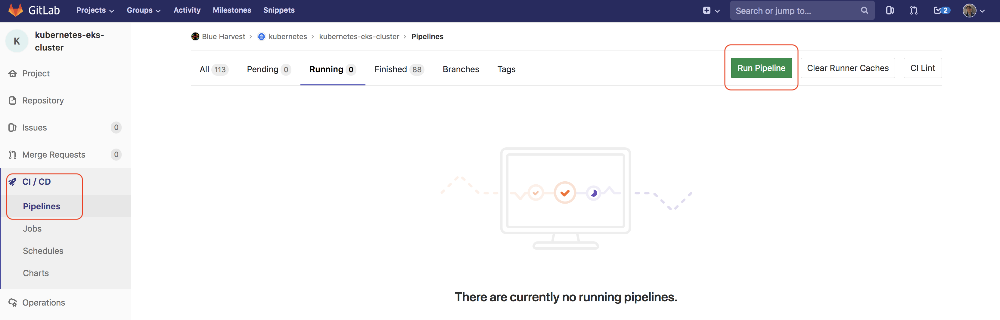
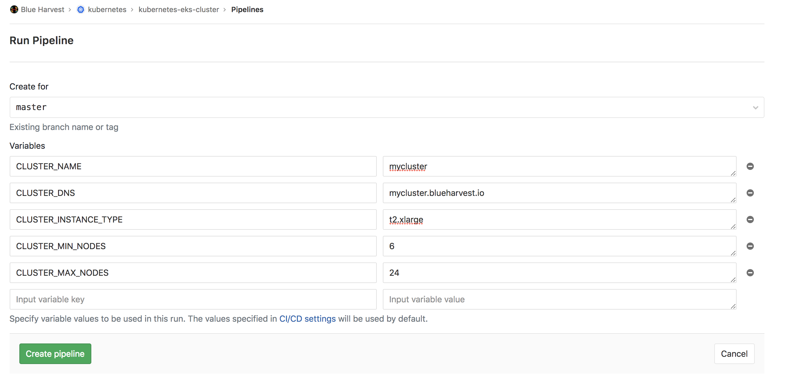
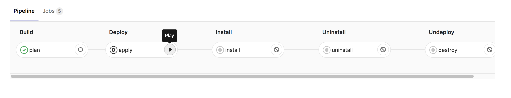
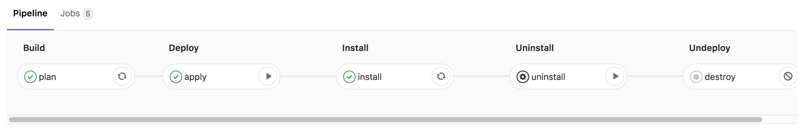

# Blue Harvest EKS Cluster

This repository contains terraform code and helm charts values to provision a fully operational Kubernetes cluster. Everything automated with a Gitlab pipeline, and parametrized so we can launch more than one cluster at the same time.

## User Guide

This guide assumes you have the source code hosted on GitLab, and that you have the required secrets defined in
your GitLab CI/CD environment variables section.

The required variables are:

* AWS_ACCESS_KEY_ID
* AWS_SECRET_ACCESS_KEY
* AWS_DEFAULT_REGION
* CLUSTER_PUBLIC_KEY
* CLUSTER_PRIVATE_KEY

To create your own cluster you must go to the Gitlab GUI, in particular to the CI/CD section of this repostiroy, and click on the Run pipeline button:

***

***

This will bring us to the pipeline creation screen, where we can intiate and parametrize a new instance of our pipeline.

***

***

The following variables are mandatory:

1. **CLUSTER_NAME**: This is going to be the name of the EKS cluster, but it also will be used to separate the terraform state of your cluster.

2. **CLUSTER_DNS**:  This will be the base dns used for all the management add-ons that the pipeline will install. So if you set this variable to ``mycluster.blueharvest.io``, you will be able to reach for example the kubernetes dashboard at https://dashboard.mycluster.blueharvest.io

The rest of the variables are optional, and they will take by default the values that are shown in the picture. Just keep in mind that a powerful instnce type is reomended.

After submiting this form, your pipeline will be initiated, and the build stage will be exectued. The first stage contains a job running terraform plan, which only will show the list of AWS resources to be created.

To move on and actually get the cluster creation process started, we need to click on apply, which is a manual job, as shown in the picture bellow.

***

***

After the terraform apply job finishes, the install job will be triggered automatically. This job will take care of setting up the required HELM charts to make the cluster fully operational.

Once the two jobs are finished, the pipeline will be paused, until you decide to put your cluster down, by clicking on the destroy job button:

***

***

Once the cluster is created, you will need to download the kubeconfig and .ovpn configuration files by clicking on the followig button:

***

***

Inside the configuration.zip file, we will find a file named kubeconfig_$CLUSTER_NAME and another file called $CLUSTER_NAME.ovpn

You must set your KUBECONFIG environment var pointing to the kubeconfig file, and open the ovpn file with an Open VPN client.

```bash 
$ export KUBECONFIG=<PATH>/kubeconfig_$CLUSTER_NAME
```

To actually use your kubectl command line tool, you will need the aws authentication command line tool in your system:

```bash 
$ curl -L https://github.com/kubernetes-sigs/aws-iam-authenticator/releases/download/v0.3.0/heptio-authenticator-aws_0.3.0_darwin_amd64 >> /usr/local/bin/heptio-authenticator-aws
$ chmod 755 /usr/local/bin/heptio-authenticator-aws
```

Plus, your AWS environment variables (AWS_ACCESS_KEY_ID, AWS_SECRET_ACCESS_KEY, AWS_DEFAULT_REGION) must be also properly set.

At this point, you must be able to run the following command and see all the pods running in your cluster:

```bash 
$ kubectl get pods --all-namespaces
```

With the OpenVPN properly connected, you also must be able to reach the following endpoints:

* https://dashboard.mycluster.blueharvest.io
* https://kibana.mycluster.blueharvest.io
* https://grafana.mycluster.blueharvest.io
* https://cerebro.mycluster.blueharvest.io
   

## Architecture

* EKS
* EC2
* Terraform
* Helm