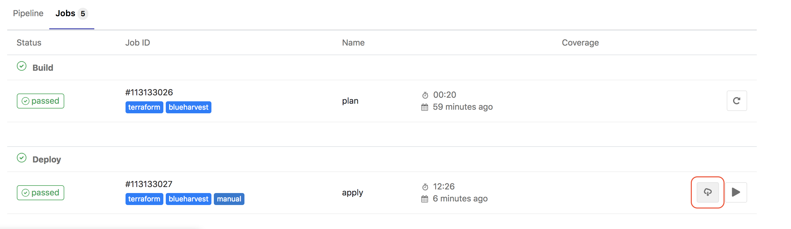

# Blue Harvest EKS Cluster

This repository contains terraform code to provision a fully operational EKS Kubernetes cluster.
## User Guide

This guide assumes you have the source code hosted on GitLab, and that you have the required secrets defined in
your GitLab CI/CD environment variables section.

The required variables are:

* AWS_ACCESS_KEY_ID: Same variable used with AWS CLI
* AWS_SECRET_ACCESS_KEY: Same variable used with AWS CLI
* AWS_DEFAULT_REGION: Same variable used  with AWS CLI

To create your own cluster you must go to the Gitlab GUI, in particular to the CI/CD section of this repostiroy, and click on the Run pipeline button.

Once the cluster is created, you will need to download the kubeconfig and .ovpn configuration files by clicking on the followig button:

***

***

Inside the configuration.zip file, we will find a file named kubeconfig_$CLUSTER_NAME and another file called $CLUSTER_NAME.ovpn

You must set your KUBECONFIG environment var pointing to the kubeconfig file, and open the ovpn file with an Open VPN client.

```bash 
$ export KUBECONFIG=<PATH>/kubeconfig_$CLUSTER_NAME
```

To actually use your kubectl command line tool, you will need the aws authentication command line tool in your system:

```bash 
$ curl -L https://github.com/kubernetes-sigs/aws-iam-authenticator/releases/download/v0.3.0/heptio-authenticator-aws_0.3.0_darwin_amd64 >> /usr/local/bin/aws-iam-authenticator
$ chmod 755 /usr/local/bin/aws-iam-authenticator
```

Plus, your AWS environment variables (AWS_ACCESS_KEY_ID, AWS_SECRET_ACCESS_KEY, AWS_DEFAULT_REGION) must be defined, and they must belong to a user added to the aws-auth config map or to the user that has run the terraform command.

At this point, you must be able to run the following command and see all the pods running in your cluster:

```bash 
$ kubectl get pods --all-namespaces
```

With the OpenVPN properly connected, you also must be able to reach the following endpoints:

* https://dashboard.<CLUSTER_NAME>.blueharvest.io
* https://kibana.eks.<CLUSTER_NAME>.blueharvest.io/
* https://grafana.<CLUSTER_NAME>.blueharvest.io
* https://cerebro.<CLUSTER_NAME>.blueharvest.io
* https://prometheus.<CLUSTER_NAME>.blueharvest.io
* https://alertmanager.<CLUSTER_NAME>.blueharvest.io
* https://pushgateway.<CLUSTER_NAME>.blueharvest.io
* https://servicegraph.<CLUSTER_NAME>.blueharvest.io
* https://tracing.<CLUSTER_NAME>.blueharvest.io
* https://kiali.<CLUSTER_NAME>.blueharvest.io
   

## Architecture

* EKS
* EC2
* Terraform
* Helm
* Istio
* Prometheus
* Grafana
* EFK
* Cluster Autoscaler
* Cert Manager
* External DNS
* NGINX Controller